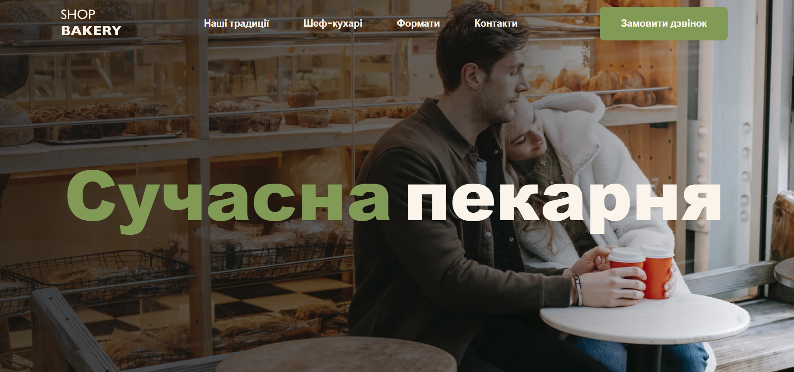
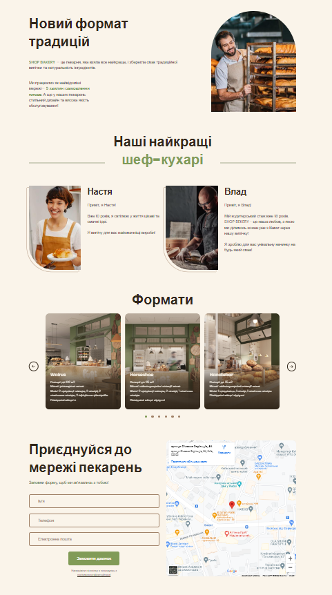

# Shop bakery

Welcome to Shop bakery, application for a company that offers and sells fresh and delicious baked
goods.

## Table of Contents

- [Overview](#overview)
- [Features](#features)
- [Technologies Used](#technologies-used)
- [Screenshots](#screenshots)
- [License](#license)
- [Contact](#connect-with-me)

## Overview

**Shop Bakery** is an app designed for bakeries that provides a pleasant and user-friendly user
experience to explore bakery traditions, bakers, and cozy hangouts.

The application includes a header, a main section with a “Request a call” button, and sections with
information about what idioms the company adheres to, who bakes delicious pastries and where you can
sit in the bakery cafe. The footer contains all contact information.

In addition, users can request a call back by filling out a form on the main page or through a modal
window. Also, for user convenience, there is a map with the location of the main office.

## Features

- Desktop, tablet, mobile - **adaptive layout**
- **BEM methodology**
- Header for easy navigation and mobile menu
- Hero section with a "Request a call" CTA button
- Modal window for feedback with clients
- Company benefits
- "Our traditions" section
- "Our the best chefs" section
- Slider with an overview of formats using Swiper
- Contacts section with form and a "Request a call" CTA button
- Map with point to central office
- Footer with contact information

## Technologies Used

## Demo

[Demo](sokolova88.github.io/Shop-bakery/)

## Screenshots

 _Caption for Screenshot 1 - Hero Section_

  

<!--  _Caption for Screenshot 2 - Main Section_ -->

## Issues

If you encounter any issues or have suggestions, please
[open an issue](https://github.com/Sokolova88/Shop-bakery/issues).

## License

This project is licensed under the [MIT License](LICENSE).

## Feedback

I welcome feedback and suggestions from users to improve the application's functionality and user
experience.

## Languages and Tools:

## Connect with me:

<a href="https://www.facebook.com/anchoysss" target="_blank">

